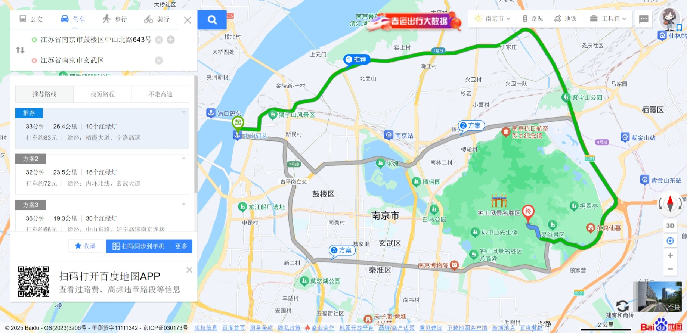
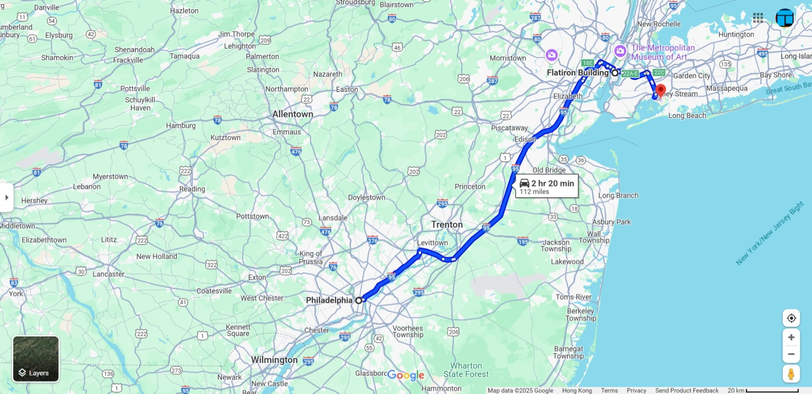

# map-cleaner

[中文版](README_zh.md)

Clear things such as toolbox, search bar on map website.

## Install

[Install via Greasy Fork](https://greasyfork.org/scripts/523967-map-cleaner)

## Supports

- Google Maps
  - Before: 
  - After: 
- Baidu Maps
  - Before: 
  - After: 
- Amap
  - Before: 
  - After: 

## Usage

Press `F2` to show/hide things.

## Known issues

- In Google Maps, if hid, press `F2` again, not all things will be restored. 
  
  You may click expand button in the left of the page to restore.
- Sometimes press `F2` and nothing happens. You can press `F2` again.

## Source

The code is from [Greasy Fork](https://greasyfork.org/zh-CN/scripts/22954-hide-search-box-for-google-maps-baidu-maps) by [ZeroCode](https://greasyfork.org/zh-CN/users/64223-zerocode); I just add some features by authorization.

[Related discussion on Greasy Fork](https://greasyfork.org/zh-CN/scripts/22954-hide-search-box-for-google-maps-baidu-maps/discussions/201650)

## License

MIT License.