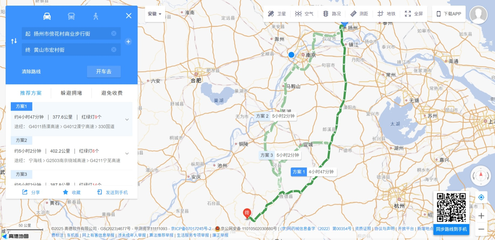

# map-cleaner

隐藏地图网站上的诸如工具栏、搜索框等控件。

## 支持

- 谷歌地图
  - 之前：
  - 之后：
- 百度地图
  - 之前：
  - 之后：
- 高德地图
  - 之前：
  - 之后：

## 使用方法

按 `F2` 键显示/隐藏这些控件。

## 已知问题

- 在 Google 地图中，如果隐藏了控件，再次按下 `F2`，并非所有内容都会恢复。
  
  你可以点击页面左侧的展开按钮来还原。
- 有时按 `F2` 不会发生任何操作。你可以再按一次 `F2`。

## 代码来源

代码来自 [ZeroCode](https://greasyfork.org/zh-CN/users/64223-zerocode) 的 [Greasy Fork](https://greasyfork.org/zh-CN/scripts/22954-hide-search-box-for-google-maps-baidu-maps)；我只是获得授权添加了一些功能。

[关于 Greasy Fork 的相关讨论](https://greasyfork.org/zh-CN/scripts/22954-hide-search-box-for-google-maps-baidu-maps/discussions/201650)

## 许可证

MIT 许可。